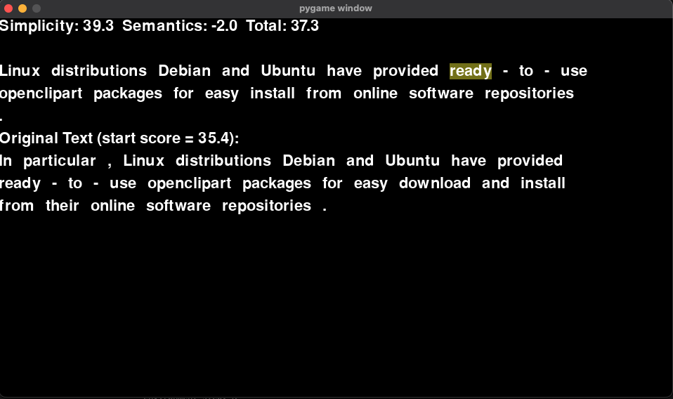
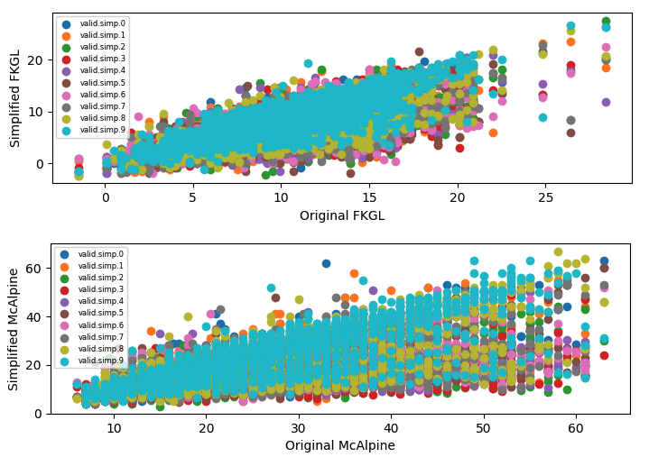

# Multi-Step Text Simplification with Reinforcement Learning

We built a Text Simplification game that can be mastered by a Reinforcement Learning agent. The game player moves a word cursor through a text, using keyboard commands to choose simplifying actions or word deletions. Simplifying actions are executed by traditional NLP or large language model tools. The player's score is based on a combination of final text simplicity and semantic preservation vis-a-vis the original text. We use OpenAI Gym to define a custom reinforcement learning environment based on the game. Python and PyTorch are used to train an RL agent to master the game. We use DQN RL policy.  

## The Game

Python code for the game and OpenAI Gym environment is in ./gyms/gyms/env/text_world.py. To play the game as a human, use the command 'python text_world.py' from this directory. You will be presented with a PyGame user interface displaying a sentence simplification task: 



You can simplify the text using the following keyboard commands (all caps): 
  "L" - move word cursor left
  "R" - move word cursor right
  "D" - drop current word
  "S" - try to simplify current word
  "B" - try to break up long sentences
  "Q" - quit game

The original texts presented by the game are drawn randomly from the 2,000 item validation set of the ASSET Corpus: https://github.com/facebookresearch/asset. Any other corpus can easily be used.

Game scores are described in greater detail below. The objective is to increase the score as compared to the original text score. The final text score minus the original text score is the reward. A positive reward should indicate that the text has been simplified while adequately preserving semantics. The player is rewarded for simplicity and penalized for semantic drift.

## Installation

Installation is a bit complex because of the multiple packages involved. 

1. Clone

First, clone the git respository

2. Create a virtual environment

I would encourage you to create a virtual environment for the project.
```sh
python3 -m venv venv
source venv/bin/activate
```

3. Install requirements
There are many packages required for the project. The requirements.txt file can be used to get traditional python dependencies.

```sh
pip install -r requirements.txt
```

Also: the "gyms" directory in this repo includes a custom Gym environment that must be pip installed. In order to pip install the custom gym, you will need to run: 

```sh
pip install -e gyms
```

The game also relies on Spacy for certain NLP functions. You will need to install Spacy English packages.

```sh
python3 -m spacy download en_core_web_sm
python3 -m spacy download en
```

4. Create your own .env file
Secrets (i.e., huggingface token, openai api key) are to be stored as environment variables.

I would encourage you to create a .env file that is written such that 'source .env' will make all the needed initializations.

Also: in my .env file I have included the shell code that is required to download the Spacy language model. 

Here is an example written in a way that is compatible with MacOS/zsh: 

```sh
export TOKENIZERS_PARALLELISM=False
export HF_TOKEN='putyourhugginfacetokenhere'
export OPENAI_API_KEY='putyouropenaiapikeyhere'
```

You can then use your .env file to complete setup: 

```sh
source .env
```
## Human-Level Performance Baseline

The ASSET Corpus provides us with 10 human-generated simplifications for each example in the validation set. Using this data we have started to examine how human simplifications tend to affect text metrics for simplicity and semantic preservation. We will use this analysis to inform the construction and refinement of an appropriate "score" and reward function. 

### Simplicity

For simplicity, one measure we have examined is the widely used Flesch-Kincaid Grade Level score (FKGL). For more about this score, see here -> https://en.wikipedia.org/wiki/Flesch–Kincaid_readability_tests#Flesch–Kincaid_grade_level

The human-performed simplifications captured in the ASSET Corpus tend to lower FKGL scores- unless the original text already has very low scores. 

The mean original text FKGL score was about 10. Human simplifications ranged from 7-9. GPT-3 davinci zero-shot simplification achieved 7, essentially indistinguishable from typical human-level performance on this measure. 

Another measure we have examined is McAlpine EFLAW score. The mean original text McAlpine score was 26, while the human simplification means ranged from 16-24. GPT-3 davinci zero-shot achieved 22.  

Based on these statistics, for a medium-complexity text we believe targeting up to 5 FKGL points of improvement or 10 McAlpine points of improvement would represent strong performance compared with human averages. Fewer points of improvement will be possible on less complex texts.

The following charts illustrate the relationship between original text FKGL/McAlpine and simplified text scores across 2000 examples in the ASSET Corpus and 10 human simplifiers. 



Ref: baseline.py 

For our first iteration, we propose a composite simplicity score that is 
(30-FKGL)+(70-McAlpine)/2

A higher score is accorded to lower FKGL and McAlpine values, recognizing that roughly 5 points on FKGL is similar to 10 points on McAlpine. In this framework, roughly a maximum of 60 points is achievable for simplicity.

For future work, it may be relevant to fit a second order polynomial to the FKGL and McAlpine simplification plots to reflect the fact that we should target smaller simplifications for texts that start with low scores. 

### Semantic Preservation

To measure semantic preservation, we use a large language model (LLM) to create a vector embedding of the original and simplified texts and measure the cosine similarity of the embeddings. 

Currently, we are using embeddings from OpenAI's babbage model. We have also examined using the following model from huggingface, which seemed to have reasonable performance: 
sentence-transformers/all-MiniLM-L6-v2

We are also interested in trying the simcse python package. More about SimCSE here:  

https://arxiv.org/abs/2104.08821

Based on the ASSET Corpus, human performance typically results in similarity scores in mid-90's after simplification. This is based on some preliminary data exploration, see the file baseline.py.   

We propose a semantic preservation score that offsets simplification gains when similarity falls.
  -100*(1-similarity)

As we observe how the end-to-end model performs, we may want to examine this more closely. Intuitively, we may want to penalize semantic drift using an exponential function - it seems likely that semantic drift should get more expensive the further we stray from the original text. 

## RL Model, Loss Function, Hyperparameters

We built the game with a graphical user interface (GUI) for humans; however, the relevant game state is actually quite simple. (The GUI itself would be a far too complex way to convey state for this game.) 

Today we convey game state to the RL agent using a simple 4-element array. The 4 elements are: selected word length, lemma length, number of word dependencies, and number of words in current sentence. We will probably also add a part of speech code. These values are readily calculated using the python Spacy NLP package.

We have started end-to-end testing using a simplistic "dummy" RL model that consists of 4 inputs, a series of 32-node layers with Relu activations, and a 6 - action output layer corresponding to the six possible keyboard commands. The model is specified in the file rl_model.py. The agent and the training loop are in the file train.py.We will test out a simplistic model first, then consider improvements and elaborations. 

## Initial Results

We have been able to run the end-to-end system and show consistent learning progress of the agent. We have saved a neural network model that learned to improve score by +6 points on average over 100 games. One clear finding from reviewing results is that the agent relied excessively on a single discrete action to achieve simplification. The agent learned to repeatedly apply action "B" - 'try to break up long sentences'. The game performs this particular action using GPT-3 davinci using prompt "Split complex sentences into simple sentences." We think we can continue to improve the agent by getting it to learn additional actions, especially simple actions such as dropping or finding simpler alternatives for excessively long words. 

This is a very preliminary result and for future runs we will have better analysis of results. 

# Credits (preliminary - more to come)

## ASSET Corpus
@inproceedings{alva-manchego-etal-2020-asset,
    title = "{ASSET}: {A} Dataset for Tuning and Evaluation of Sentence Simplification Models with Multiple Rewriting Transformations",
    author = "Alva-Manchego, Fernando  and
      Martin, Louis  and
      Bordes, Antoine  and
      Scarton, Carolina  and
      Sagot, Beno{\^\i}t  and
      Specia, Lucia",
    booktitle = "Proceedings of the 58th Annual Meeting of the Association for Computational Linguistics",
    month = jul,
    year = "2020",
    address = "Online",
    publisher = "Association for Computational Linguistics",
    url = "https://www.aclweb.org/anthology/2020.acl-main.424",
    pages = "4668--4679",
}

## Deep Reinforcement Learning Hands-On
Author: Maxim Lapan
Publisher: Packt
This book was helpful to get started creating a RL Agent and training loop that works together with an OpenAI Gym environment. 

## OpenAI
Our current implementation is using OpenAI GPT-3 to search for synonyms and to break up complex sentences. 
https://openai.com/api/

## OpenAI Gym
@misc{1606.01540,
  Author = {Greg Brockman and Vicki Cheung and Ludwig Pettersson and Jonas Schneider and John Schulman and Jie Tang and Wojciech Zaremba},
  Title = {OpenAI Gym},
  Year = {2016},
  Eprint = {arXiv:1606.01540},
}

## spaCy
cff-version: 1.2.0
preferred-citation:
  type: article
  message: "If you use spaCy, please cite it as below."
  authors:
  - family-names: "Honnibal"
    given-names: "Matthew"
  - family-names: "Montani"
    given-names: "Ines"
  - family-names: "Van Landeghem"
    given-names: "Sofie"
  - family-names: "Boyd"
    given-names: "Adriane"
  title: "spaCy: Industrial-strength Natural Language Processing in Python"
  doi: "10.5281/zenodo.1212303"
  year: 2020


