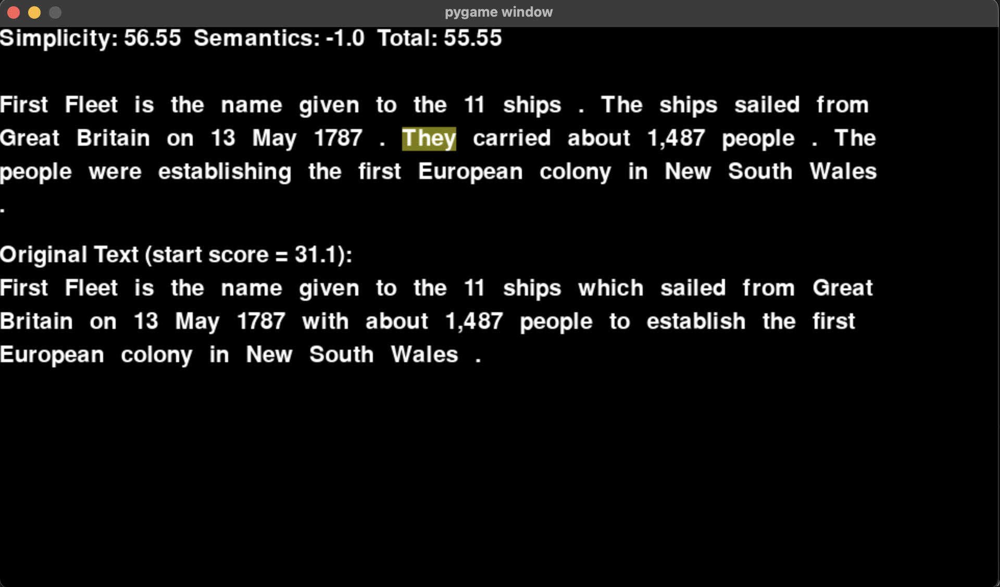

# Edit-Based Text Simplification with Reinforcement Learning

We built a Text Simplification game that can be played by a Reinforcement Learning agent. The game player moves a word cursor through a text, using keyboard commands to choose simplifying actions or word deletions. Simplifying actions are executed with assistance from fine-tuned large language models. The player's score is based on a combination of final text simplicity and semantic preservation vis-a-vis the original text. The game is built in PyGame and we use OpenAI Gym to define a custom reinforcement learning environment. Python and PyTorch are used to train an RL agent to play the game. We use a simplified DQN RL architecture (no convolution layers in the policy network).

## The Game

Python code for the game and OpenAI Gym environment is in ./gyms/gyms/env/text_world.py. To play the game as a human, use the command 'python text_world.py' from this directory. You will be presented with a PyGame user interface displaying a sentence simplification task: 



You can simplify the text using the following keyboard commands (all caps): 
  "S" - Split-and-Rephrase (Structural simplification)
  "L" - Simplify Words (Lexical Simplification)
  "D" - Drop current word - only allowed if game deems the result grammatical
  "K" - Keep current word

Split-and-Rephrase is a sentence splitting operation first outlined by Narayan et al (2017) and later built upon in the work of Zhang et al (2020). Our implementation uses a GPT-3 fine-tuned on Zhang's Wiki-BM corpus. This operation turned out to be highly effective at lowering simlicity scores while preserving semantics.

To implement Lexical Simplification, we fine-tuned GPT-3 on a subset of TurkCorpus. We think our implementation of Lexical Simplification leaves room for improvement in future iterations. 

We implemented Drop Word on a token-by-token basis, with grammar checking performed by a large language model we trained on the Corpus of Linguistic Acceptability (Warstadt et al, 2019). We felt this is a plausible operation to implement at a word level, but we have leared that even the dropping of individual words is significantly dependent on the context of the entire sentence. Drop Word could be improved even if just tuples or triples of words are considered at once, or a "Drop Phrase" action were added. In general, we have learned word dropping like Split-and-Rephrase and Lexical Simplification, is probably best performed by a large language model in the context of an entire sentence or text. 

Original texts presented by the game are drawn randomly from the 2,000 item validation set of the ASSET Corpus: https://github.com/facebookresearch/asset (Manchego et al, 2018). Other corpora can easily be used. The game uses texts from the file gametexts.json. 

Game scores are described in greater detail below. The objective is to increase the score as compared to the original text score. The final text score minus the original text score is the reward. A positive reward should indicate that the text has been simplified while adequately preserving semantics. The player is rewarded for simplicity and penalized for semantic drift.

## Installation

Installation is a bit complex because of the multiple packages involved. 

1. Clone

First, clone the git respository

2. Create a virtual environment

I would encourage you to create a virtual environment for the project.
```sh
python3 -m venv venv
source venv/bin/activate
```

3. Install requirements
There are many packages required for the project. The requirements.txt file can be used to get traditional python dependencies.

```sh
pip install -r requirements.txt
```

Also: the "gyms" directory in this repo includes a custom Gym environment that must be pip installed. In order to pip install the custom gym, you will need to run: 

```sh
pip install -e gyms
```

The game also relies on Spacy for certain NLP functions. You will need to install Spacy English packages.

```sh
python3 -m spacy download en_core_web_sm
python3 -m spacy download en
```

4. Create your own .env file
Secrets (i.e., huggingface token, openai api key) are to be stored as environment variables.

I would encourage you to create a .env file that is written such that 'source .env' will make all the needed initializations.

Here is an example written in a way that is compatible with MacOS/zsh: 

```sh
export HF_TOKEN='putyourhugginfacetokenhere'
export OPENAI_API_KEY='putyouropenaiapikeyhere'
```

You can then use your .env file to complete setup: 

```sh
source .env
```
## Results

A more in-depth explanation of the project and preliminary results can be seen in the file CS230_2022_Final_Project FINAL.pdf. 

### A Word About Simplicity

For simplicity, one measure we have examined is the widely used Flesch-Kincaid Grade Level score (FKGL). For more about this score, see here -> https://en.wikipedia.org/wiki/Flesch–Kincaid_readability_tests#Flesch–Kincaid_grade_level

The human-performed simplifications captured in the ASSET Corpus tend to lower FKGL scores, unless the original text already has very low scores. 

The mean original text FKGL score was about 10. Human simplifications ranged from 7-9. One example GPT-3 davinci zero-shot simplification achieved 7, essentially indistinguishable from typical human-level performance on this measure. 

Another measure we have examined is McAlpine EFLAW score. The mean original text McAlpine score was 26, while the human simplification means ranged from 16-24. Our GPT-3 davinci zero-shot achieved 22.  

Based on these statistics, for a medium-complexity text we believe targeting up to 5 FKGL points of improvement or 10 McAlpine points of improvement would represent strong performance compared with human averages. Fewer points of improvement will be possible on less complex texts.

The following charts illustrate the relationship between original text FKGL/McAlpine and simplified text scores across 2000 examples in the ASSET Corpus and 10 human simplifiers. 


Ref: baseline.py 

For our first iteration of this game, we propose a composite simplicity score that is 
(30-FKGL)+(70-McAlpine)/2

A higher score is accorded to lower FKGL and McAlpine values, recognizing that roughly 5 points on FKGL is similar to 10 points on McAlpine. In this framework, roughly a maximum of 60 points is achievable for simplicity.

For future work, it may be relevant to fit a second order polynomial to the FKGL and McAlpine simplification plots to reflect the fact that we should expect smaller simplifications for texts that start with low scores. 

### Semantic Preservation

To measure semantic preservation, we use a large language model (LLM) to create a vector embedding of the original and simplified texts and measure the cosine similarity of the embeddings. 

Currently, we are using embeddings from OpenAI's babbage model. We have also examined using the following model from huggingface, which seemed to have reasonable performance: 
sentence-transformers/all-MiniLM-L6-v2

We are also interested in trying the simcse Python package. More about SimCSE here:  

https://arxiv.org/abs/2104.08821

Based on the ASSET Corpus, human performance typically results in similarity scores in mid-90's after simplification. This is based on some preliminary data exploration, see the file baseline.py.   

We propose a semantic preservation score that offsets simplification gains when similarity falls.
  100*(similarity-1)

We may want to examine this more closely. Intuitively, we may want to penalize semantic drift using an exponential function - it seems plausible that semantic drift should get more expensive the further we stray from the original text. 

## RL Model, Loss Function, Hyperparameters

We built the game with a graphical user interface (GUI) for humans; however, the relevant game state is actually quite simple. (The GUI itself would be a far too complex way to convey state for this game.) 

Today we convey game state to the RL agent using a simple state space that conveys easily calculated information about the current word and the whole text. Certain values are calculated using the Spacy NLP package. For details see the paper referenced above. With a simple state space and a simple action space, we can use a simple policy network.

As we built this game, we realized how important the context of the entire text (or, at least an entire sentence) is even when trying to accomplish **seemingly** word-level operations like "simplify word" and "drop word". 

In the next iteration of the project, we would probably keep increasing the focus on sentence- or text-level state information and actions. Word-level actions are simply of limited utility. 

An interesting text-level state space to construct would be an embedding vector that captures problematic, unclear, and ungrammatical style and fluency. An embedding vector like this could be useful in guiding the agent to choose simplifying actions.

# Credits

The project builds on a large amount of research and toolkits created by very talented and dedicated people. For more details please see the paper linked above.

Al-Thanyyan, S. S., & Azmi, A. M. (2021). Automated text simplification: a survey. ACM Computing Surveys (CSUR), 54(2), 1-36.

Alva-Manchego, F., Martin, L., Scarton, C., & Specia, L. (2019). EASSE: Easier automatic sentence simplification evaluation. arXiv preprint arXiv:1908.04567.

Alva-Manchego, F., Martin, L., Bordes, A., Scarton, C., Sagot, B., & Specia, L. (2020). ASSET: A dataset for tuning and evaluation of sentence simplification models with multiple rewriting transformations. arXiv preprint arXiv:2005.00481.

Alva-Manchego, F., Scarton, C., & Specia, L. (2021). The (un) suitability of automatic evaluation metrics for text simplification. Computational Linguistics, 47(4), 861-889.

Brockman, G., Cheung, V., Pettersson, L., Schneider, J., Schulman, J., Tang, J., & Zaremba, W. (2016). Openai gym. arXiv preprint arXiv:1606.01540.

Brown, T., Mann, B., Ryder, N., Subbiah, M., Kaplan, J. D., Dhariwal, P., ... & Amodei, D. (2020). Language models are few-shot learners. Advances in neural information processing systems, 33, 1877-1901.

Honnibal, M., Montani, I., Van Landeghem, S., Boyd, A. (2020). spaCy: Industrial-strength Natural Language Processing in Python. 

Huang, S., Dossa, R. F. J., Ye, C., & Braga, J. (2021). CleanRL: High-quality Single-file Implementations of Deep Reinforcement Learning Algorithms. arXiv preprint arXiv:2111.08819.

Kumar, D., Mou, L., Golab, L., & Vechtomova, O. (2020). Iterative edit-based unsupervised sentence simplification. arXiv preprint arXiv:2006.09639.

Lapan, M. (2020) Deep Reinforcement Learning Hands-On. Packt Publishing.

Kincaid, J. P., Fishburne Jr, R. P., Rogers, R. L., & Chissom, B. S. (1975). Derivation of new readability formulas (automated readability index, fog count and flesch reading ease formula) for navy enlisted personnel. Naval Technical Training Command Millington TN Research Branch.

McAlpine, Rachel. (1997). Global English for global business. Longman.

Mnih, V., Kavukcuoglu, K., Silver, D., Rusu, A. A., Veness, J., Bellemare, M. G., ... & Hassabis, D. (2015). Human-level control through deep reinforcement learning. nature, 518(7540), 529-533.

Nakamachi, A., Kajiwara, T., & Arase, Y. (2020, December). Text Simplification with Reinforcement Learning Using Supervised Rewards on Grammaticality, Meaning Preservation, and Simplicity. In Proceedings of the 1st Conference of the Asia-Pacific Chapter of the Association for Computational Linguistics and the 10th International Joint Conference on Natural Language Processing: Student Research Workshop (pp. 153-159).

Napoles, C., Sakaguchi, K., & Tetreault, J. (2017). JFLEG: A fluency corpus and benchmark for grammatical error correction. arXiv preprint arXiv:1702.04066.

Narayan, S., Gardent, C., Cohen, S. B., & Shimorina, A. (2017). Split and rephrase. arXiv preprint arXiv:1707.06971.

Paszke, A., Gross, S., Massa, F., Lerer, A., Bradbury, J., Chanan, G., ... & Chintala, S. (2019). Pytorch: An imperative style, high-performance deep learning library. Advances in neural information processing systems, 32.

Shardlow, M. (2014). A survey of automated text simplification. International Journal of Advanced Computer Science and Applications, 4(1), 58-70.

Van, H., Tang, Z., & Surdeanu, M. (2021). How May I Help You? Using Neural Text Simplification to Improve Downstream NLP Tasks. arXiv preprint arXiv:2109.04604.

Warstadt, A., Singh, A., & Bowman, S. R. (2019). Cola: The corpus of linguistic acceptability (with added annotations).

Xu, W., Napoles, C., Pavlick, E., Chen, Q., & Callison-Burch, C. (2016). Optimizing statistical machine translation for text simplification. Transactions of the Association for Computational Linguistics, 4, 401-415.

Yanamoto, D., Ikawa, T., Kajiwara, T., Ninomiya, T., Uchida, S., & Arase, Y. (2022, November). Controllable Text Simplification with Deep Reinforcement Learning. In Proceedings of the 2nd Conference of the Asia-Pacific Chapter of the Association for Computational Linguistics and the 12th International Joint Conference on Natural Language Processing (pp. 398-404).

Zhang, X., & Lapata, M. (2017). Sentence simplification with deep reinforcement learning. arXiv preprint arXiv:1703.10931.

Zhang, L., Zhu, H., Brahma, S., & Li, Y. (2020). Small but mighty: New benchmarks for split and rephrase. arXiv preprint arXiv:2009.08560.

Zhao, S., Meng, R., He, D., Andi, S., & Bambang, P. (2018). Integrating transformer and paraphrase rules for sentence simplification. arXiv preprint arXiv:1810.11193.
